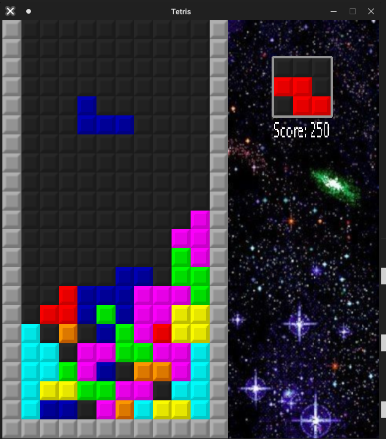

# tetris-cpp-sdl2

My Tetris clone in C++ with SDL2.



# Dependencies
  * SDL2
  * SDL2_image
  * SDL2_ttf
 
# Installation (on Linux)
  * Install dependencies
  ```
  (On Debian based systems)
  
  sudo apt install libsdl2-2.0-0 libsdl2-image-2.0-0 libsdl2-ttf-2.0-0
  ```
  * Download the source code
  * Compile:
  ```
  g++ *.cpp -lSDL2 -lSDL2_image -lSDL2_ttf -o tetris
  ```
  * Run:
  ```
   ./tetris
  ```
  
# Controls
  * [Left-Arrow]/[Right-Arrow] - Move piece left/right
  * [Down-Arrow] - Move piece one row down
  * [A]/[D] - Rotate piece counter-clockwise/clockwise
  * [Space] - Drop piece
